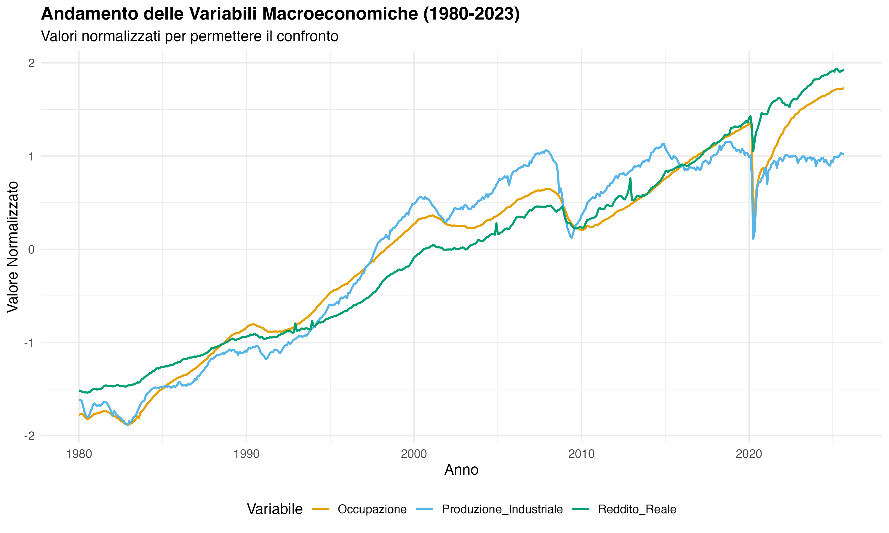
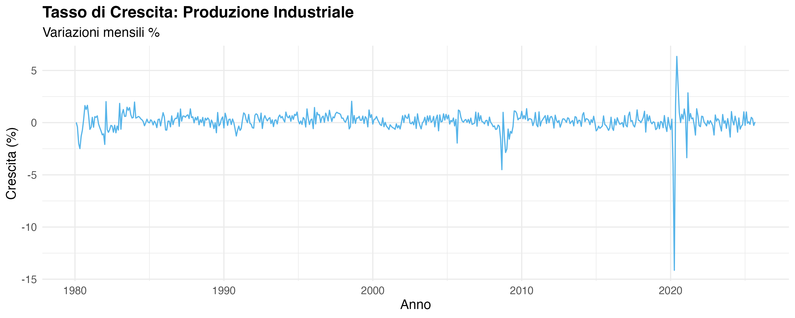

# Il battito dell'economia: Come Produzione, Lavoro e Reddito si influenzano a vicenda

*Un'analisi econometrica completa delle dinamiche macroeconomiche statunitensi (1980-2023) per un portfolio da Data Scientist.*

L'economia è un sistema complesso in cui le variabili non si muovono isolatamente, ma reagiscono l'una all'altra formando una vera e propria reazione a catena. In questo progetto ho analizzato la trasmissione degli shock macroeconomici negli Stati Uniti, studiando tre serie storiche fondamentali estratte dal database FRED:

1. **Produzione Industriale (INDPRO)**: Output reale dei settori manifatturiero, minerario e utility. È l'indicatore più ciclico e reattivo.
2. **Occupazione Non Agricola (PAYEMS)**: Totale dei dipendenti. Rappresenta la salute del mercato del lavoro.
3. **Reddito Personale Reale (W875RX1)**: Il reddito al netto di inflazione e trasferimenti statali, proxy della capacità di spesa.

L'obiettivo dell'analisi è determinare **come** e **in che ordine** queste tre dimensioni economiche interagiscono nel breve e nel lungo periodo.

---

## 1. Analisi Esplorativa e Stazionarietà

Il primo passo per modellare serie storiche macroeconomiche è comprenderne la natura. Tracciando i dati storici, è emersa la forte reattività della Produzione alle crisi (es. 2008, 2020), la lenta dinamica di recupero dell'Occupazione e il trend strutturale del Reddito.



### Trasformazioni e Test di Dickey-Fuller (ADF)
Trattandosi di serie con trend esponenziali (crescita cumulativa nel lungo periodo), ho prima applicato una trasformazione logaritmica. Successivamente, ho utilizzato i correlogrammi (ACF e PACF) e test formali per valutarne la stazionarietà.

Ho applicato il **Test di Dickey-Fuller Aumentato (ADF)** con un approccio sequenziale: testando prima la presenza di un trend deterministico e poi di un *drift* (costante).
I risultati hanno confermato che tutte e tre le variabili sono non stazionarie sui livelli (processi *Random Walk con drift*), ma diventano stazionarie differenziandole una volta (sono processi **I(1)**). 

---

## 2. Cointegrazione: Il test di Johansen e il VECM

Due o più serie storiche non stazionarie possono "condividere" un trend stocastico di lungo periodo. Se così fosse, eventuali scostamenti temporanei tenderebbero ad essere corretti nel tempo verso un equilibrio di lungo periodo.

Per verificare questa ipotesi, ho selezionato il numero di *lag* ottimali tramite il criterio di informazione **BIC** e ho applicato la procedura di **Johansen** (Trace Test e Max Eigenvalue).

```r
library(urca)
# Faccio calcolare al criterio BIC il numero di ritardi ottimali
lag_select <- VARselect(stima, lag.max = 12, type = "both")
K_opt <- lag_select$selection['SC(n)']

# Eseguo il test di Johansen (Trace Test) per capire se le serie sono cointegrate
vecm_jo <- ca.jo(stima, type = "trace", ecdet = "const", K = K_opt, spec = "longrun")
summary(vecm_jo)
```

**Risultati della cointegrazione:**
I test hanno individuato l'esistenza di **1 vettore di cointegrazione** ($r=1$).
Stimando il VECM ristretto, ho analizzato le due matrici fondamentali:
*   **Vettore $\beta$ (Lungo periodo)**: Ha confermato che produzione e occupazione sono legate da una relazione positiva, mentre il reddito non sembra aggiungere informazione strutturale alla capacità produttiva di lungo periodo.
*   **Matrice $\alpha$ (Coefficienti di Aggiustamento)**: Indica la velocità con cui il sistema corregge gli errori rispetto all'equilibrio. I valori trovati erano prossimi allo zero e non statisticamente significativi con il segno atteso per il riequilibrio. 

*Conclusione tecnica*: Poiché i coefficienti di aggiustamento $\alpha$ suggerivano che il meccanismo di correzione dell'errore fosse debolissimo o inesistente nel frame temporale mensile, ho scelto di abbandonare i modelli Error Correction (ECM/VECM) per concentrarmi esclusivamente sulle dinamiche di breve periodo tramite un modello **VAR** sui tassi di crescita.

---

## 3. Dinamiche di Breve Periodo: Tassi di Crescita e Cross-Correlazione

Ho trasformato le serie storiche differenziandole logaritmicamente per approssimare i **tassi di crescita mensili (%)**.



### Pre-whitening e Cross-Correlazione (CCF)
Per esplorare la relazione tra le variazioni di queste variabili, è necessario che le serie siano prive di autocorrelazione interna. Attraverso l'uso del test di Ljung-Box, ho riscontrato un'autocorrelazione persistente nei tassi della Produzione Industriale, che ho "ripulito" (pre-whitening) filtrandola con un modello **ARMA (precisamente un MA(1))**.

Le funzioni di **Cross-Correlazione (CCF)** tra i residui così ottenuti hanno svelato dinamiche fortissime:
*   La Produzione anticipa l'Occupazione (esistono correlazioni significative ai lag negativi).
*   L'Occupazione ha relazioni istantanee e anticipate con il Reddito.
Questi sono i primi indizi della catena di trasmissione.

---

## 4. Modello VAR (Vector Autoregression) e Diagnostica Avanzata

Per catturare formalmente queste interazioni, ho stimato un Modello VAR.
La selezione dei criteri d'informazione suggeriva un VAR con $p=1$.

```r
library(vars)
# Parto con una stima preliminare usando un solo ritardo (VAR(1))
modL1 <- vars::VAR(df, p = 1, type = "const")

# Controllo subito se i residui nascondono ancora autocorrelazione
Box.test(resid(modL1)[,1], lag=12, type="Ljung")
```

La diagnostica sui residui del **VAR(1)** ha evidenziato come non fosse sufficiente a catturare tutta l'autocorrelazione (p-value significativi al test di Ljung-Box). Sono perciò passato a un **VAR(2)**.

**Diagnostica del Modello VAR(2):**
*   **Stabilità**: Eccellente (tutte le radici del polinomio caratteristico < 1).
*   **Autocorrelazione multivariata**: I test di Portmanteau (Ljung-Box multivariato) e Breusch-Godfrey indicano una capacità esplicativa notevolmente migliorata rispetto al modello precedente.
*   **Normalità ed Effetti ARCH**: Il test di Jarque-Bera ha respinto l'ipotesi di normalità a causa dell'eccesso di curtosi e asimmetria. I test ARCH confermano eteroschedasticità condizionale (normale volatilità nei dati finanziari e macroeconomici).

Le forti **correlazioni contemporanee** dei residui (es. 0.73 tra Produzione e Occupazione) hanno confermato un altissimo grado di sincronizzazione del sistema davanti a shock esterni.

---

## 5. Causalità di Granger e Impulse Response (IRF)

Il vero fulcro analitico è capire chi "guida" il sistema. Tramite i test di **Causalità di Granger** e l'analisi **IRF (Impulse Response Function)**, ho districato la reazione a catena.

```r
# Verifico se la produzione industriale è in grado di prevedere da sola il resto del sistema
causality(modL2, cause="Prod")

# Controllo il legame specifico: la produzione causa l'occupazione?
grangertest(df[, "Occ"] ~ df[, "Prod"], order = 2)
```

**I Risultati dei Test:**
1. **La Produzione Industriale è il motore**: Ha un potere predittivo sul sistema estremamente alto ($p$-value $= 1.4e-09$). I test a coppie evidenziano una relazione bidirezionale tra fabbriche e posti di lavoro.
2. **Occupazione e Reddito**: Si evince una relazione netta in cui le dinamiche reali della produzione e dell'impiego guidano il reddito finale delle famiglie.

### Funzione di Risposta all'Impulso Ortogonalizzata (Cholesky)
Per mappare la trasmissione degli shock, le elevate correlazioni contemporanee hanno reso obbligatoria la *Decomposizione di Cholesky*. L'ordine di endogeneità scelto è stato:
`Produzione -> Occupazione -> Reddito`
Questa logica economica assume che uno shock "oggi" alle fabbriche si rifletta immediatamente sui turni/assunzioni e di conseguenza sulle buste paga, ma non viceversa (nello stesso esatto mese).

---

## Conclusione

Questo progetto dimostra come applicare l'econometria moderna per mappare in maniera robusta la trasmissione del valore economico. L'economia americana analizzata si muove come una **catena altamente sincronizzata**: 

1. **Inizia nelle fabbriche** (Produzione), che fungono da variabile esogena principale e recepiscono per prime gli shock.
2. **Si trasmette alle aziende** (Occupazione), che aggiustano la forza lavoro con un leggero ritardo stocastico rispetto all'output.
3. **Arriva nelle tasche** (Reddito), come esito finale dell'interazione tra decisioni produttive e mercato del lavoro.

Questa evidenza empirica, filtrata da modelli VAR multivariati rigorosi, è uno strumento essenziale per chiunque debba prendere decisioni *data-driven* in ambito aziendale o finanziario: suggerisce che per anticipare i consumi futuri (reddito), la metrica più tempestiva da monitorare rimangono gli indici anticipatori della manifattura e della produzione fisica.

---
*Competenze e tecniche applicate: Linguaggio R, Pre-processing Dati (differenze logaritmiche, pre-whitening ARMA), Test di Stazionarietà (ADF), Analisi di Cointegrazione (Test di Johansen, VECM), Modellistica Multivariata (VAR), Diagnostica dei residui (Jarque-Bera, ARCH test, Ljung-Box multivariato), Inferenza Causale (Granger Causality), e Impulse Response Functions (Decomposizione di Cholesky).*
